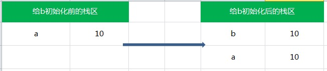
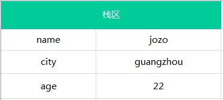
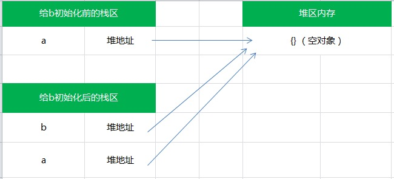
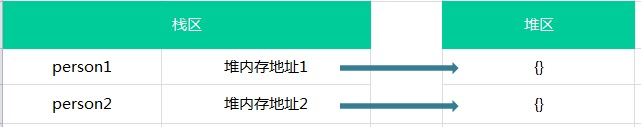
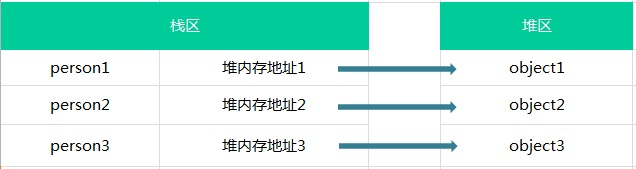

## js两种类型：原始类型和引用类型
1. 原始类型和引用类型
- 原始类型：保存为简单数据值，即通常所说的基本数据类型。
- 引用类型：保存为对象（本质是指向内存位置的指针或者说引用）
2. 原始类型和引用类型有哪些？
- 原始类型： number、string、boolean、null、undefined、Symbol（ES6新增）
- 引用类型： Array、Object、Function、Date、RegExp、Error、特殊的引用类型（原始封装类型）
3. 原始类型和引用类型的区别？
- 原始类型 
    - 原始类型的值一经确定就不可改变
    - 原始类型的赋值是简单赋值  
    如果从一个变量向另一个变量赋值基本类型的值，会在变量对象上创建一个新值，然后把改值复制到为新变量分配的位置上。

        例子：
        ```js
        var a = 10;
        var b = a;
        a++;
        console.log(a); //11
        console.log(b); //10
        ```
        上面代码中，a中保存的是10.当使用a的值来初始化b时，b中也保存了值10.但b中的10和a中的10是完全独立的。b中的值只是a中值的一个副本，所以这两个变量可以参与任何操作而不会相互影响。如图：

        
    - 原始类型的比较是值的比较

        例子：
        ```js
        var person1 = '{}';
        var person2 = '{}';
        console.log(person1 == person2); //true
        ```
        基本类型的比较--当两个比较值的类型相同的时候，相当于是用 === ，所以输出是true。

    - 原始类型的变量是存放在栈区的（栈区指内存里的栈内存） 
     
        例子：
        ```js
        var name = 'jozo';
        var city = 'guangzhou';
        var age = 22;
        ```
        存储结构如下：

        
- 引用类型
    - 引用类型的值是可变的（可以为引用类型添加属性和方法，也可以删除其属性和方法；引用类型的属性和方法是可以动态改变的；）
    - 引用类型的赋值是对象引用
      
      例子：
      ```js
      var a = {};
      var b = a;
      a.name = 'change'
      console.log(a.name);   // change
      console.log(b.name);   // change
      b.age = 29;
      console.log(a.age); // 29
      console.log(b.age); // 29
      ```
      引用类型的赋值其实是对象保存在栈区地址指针的赋值，所以两个变量指向同一个对象，任何的操作都会互相影响.

      如图：

      
    - 引用类型的比较是引用的比较
        ```js
        var person1 = {};
        var person2 = {};
        console.log(person1 == person2); //false
        ```

        引用类型是按引用访问的，换句话说就是比较两个对象的堆内存中的地址是否相同，很明显，person1和person2在堆内存中地址是不同的，这两个是完全不同的对象，所以返回false。


        存储结构如图所示：

        

    - 引用类型的值是同时保存在栈内存和堆内存中的对象
        - js不同于其他语言，其不允许直接访问内存中的位置，也就是说不能直接操作对象的内存空间，实际上，是操作对象的引用，所以引用类型的值是按引用访问的。
        - 准确地说，**引用类型的存储需要内存的栈区和堆区（堆区是指内存里的堆内存）共同完成，栈区内存保存变量标识符和指向堆内存中改对象的指针**，也可以说是改对象在堆内存中的地址  

            例子：
            ```js
            var person1 = {name: 'zhangsan'};
            var person2 = {name: 'lisi'};
            var person3 = {name: 'wangwu'};
            ```
            存储结构如下：

            


## 参考阅读
1. [JS基本类型与引用类型知多少](https://juejin.im/post/595616ea5188250da205da91)
2. [基本数据类型和引用类型的区别详解](https://segmentfault.com/a/1190000008472264)
3. [JavaScript 深入了解基本类型和引用类型的值](https://segmentfault.com/a/1190000006752076)
4. [JavaScript中基本类型、基本包装类型、引用类型的区别？](https://www.zhihu.com/question/40683360)